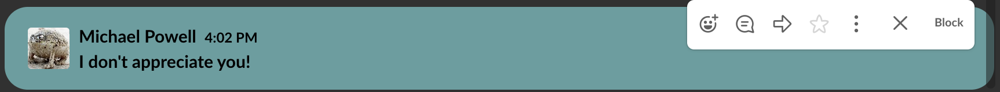

# CutieFont

## Description
CutieFont is a small Chrome extension which aims to improve the appearance and functionality of Slack.

## Technologies

  * Javascript
  
  * CSS
  
  * Google Chrome Storage

## Features

Cutiefont randomly assigns one of one hundred handpicked colors to every uses that it reads off the page. Because Slack uses React to render only a handful of messages on the page at once it was important to use mutation observers to efficiently and consistently paint all of the messages on the page.

``` javascript
function findColorId(messages, idx) {
  if (idx === 0) { return null }
  let colorId = messages[(idx - 1)].firstChild.getAttribute("data-color")
  if (colorId) {
    return parseInt(colorId)
  } else {
    return findColorId(messages, idx-1)
  }
}
```

Because some messages are not directly associated with users, CutieFont has to recursively climb through messages to find the user associated with the message. This is one reason why it was critical to implement Chrome's Storage Sync to save on resources and to give a smoother experience.



A recent addition to CutieFont's functionality is adding the ability to ignore messages and to block users. I will soon add the feature to view all ignored messages and blocked users.
